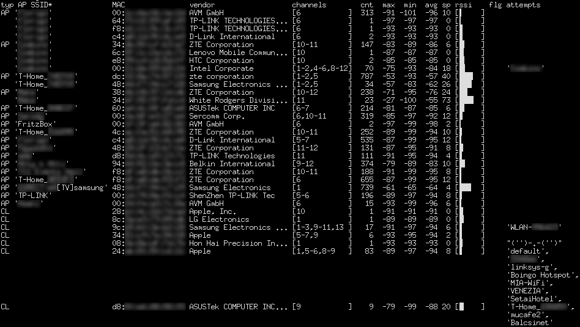

# wireless-radar

wireless-radar comes with a few tools:
 - wprox a scanner for detecting/fingerprinting active 802.11 devices
 - mrssi a simple RSSI sensor locking onto a MAC for physically locating the device
 - wscan a direction-finder using a directional antenna mounted on a usb rocket launcher
 - bprox a Bluetooth device discoverer
 - rfdiff to diff the outputs of wprox scans

## Installation

    pip install wirelessradar

Since wireless-radar tools involve manipulating network devices and
setting promiscuous mode, these need to be either run as root, or you
can create a copy of your python executable and set capabilities to
enable sniffing for user accounts in your virtual environment:

     setcap 'CAP_NET_RAW+eip CAP_NET_ADMIN+eip' env/bin/python2

## wprox

wprox sniffs on every channel as long as no new devices are found for
a preset amount of time. wproxy gathers clients trying to discover,
connect to, or communicating with APs, and APs advertising themselves
or communicating with clients. It also collects the ESSIDS of access
points the clients try to connect to (affects mostly Apple products).



Using wprox it is possible to have a more granular look into all
channels and their users. It allows for selecting a more quiet channel
for your own network, discovering less congested access points at
conferences, and generally map the wifi spectrum.

wprox has the following dependencies which are automatically handled
by the setup script:

    scapy netaddr git+https://github.com/pingflood/pythonwifi.git

before you run, you must set your wlan device to monitor mode:

    iwconfig wlan0 mode monitor

alternatively you can also create a seperate monitor device using:

    airmon-ng start wlan0
    ifconfig wlan0 down

you can then run wproxy like this:

    ./wprox.py <device>

replacing <device> with wlan0 or mon0 depending on your setup.

should result in output like this:
```
typ AP SSID*                      MAC               vendor                  channels              cnt  max  min  avg  sp rssi   flg attempts
AP 'TP-LINK_ffffff'               ff:ff:ff:ff:ff:ff TP-LINK TECHNOLOGIES    [3-7,9,11          ] 3511  -36  -80  -40 44 [███  ]
                                  ff:ff:ff:ff:ff:ff Apple, Inc.             [6                 ]   15  -73 -100  -84 27 [▊    ]     'TP-LINK_ffffff'
AP 'WifiZone1234567'              ff:ff:ff:ff:ff:ff Routerboard.com         [11                ]  178  -90  -94  -92  4 [█▌   ]
CL                                ff:ff:ff:ff:ff:ff Samsung Electronics     [3,9               ]   12  -81  -90  -89  9 [██▋  ]     'ap1', ''
```

where the first column denotes
 - AP for access points
 - nothing for associated clients
 - CL for non-associated clients
 - NA for unknown roles

for APs this is followed by the AP ESSID, and then for all device types
 - the MAC,
 - the vendor according to the MAC,
 - a list of channels this device has been observed,
 - the number of packets counted
 - strongest signal,
 - weakest signal,
 - average signal,
 - difference between strongest and weakest signal,
 - 5 char graphical signal strength indicator.
 - optional flags (C= wireless camera, D=drone)

For client devices this is followed by a list of ESSIDs the device
tried to associate with.

While wprox is running it dumps the found devices to stderr every 1
second if there's some traffic on the chan. At the end wproxy outputs
all devices again, but this time to stdout so you can save one copy in
a file.

## mrssi

mrssi allows you to lock onto one specific MAC address on a specific
channel and shows you the signal strength with a bargraph and a
histogram of the signal strength over the last 40 seconds:

```
./mrssi.py mon0 01:23:45:ff:ff:ff 6
WARNING: Failed to execute tcpdump. Check it is installed and in the PATH
WARNING: No route found for IPv6 destination :: (no default route?)
looking for 01:23:45:ff:ff:ff on mon0 chan: 6 (2.437GHz)
-75  ████████████▋                           | -79  ▃▃▂▂▂▂▂▁▁▁▁▂▄▄▄▃▄▄▃▆▅▅▄▅▅▂▆▇▅▅▆▅▅▅▄▄▃▂▁▁ -52
```

## wscan
run with::

    ./wscan.py | tee logs/home-$(date '+%s').log | ./wscan.py load

or tracking a specific AP:

    ./wscan.py 00:00:00:00:00:00 | tee logs/home-$(date '+%s').log | ./wscan.py load

this gives you realtime feedback on RSSI strength for a given BSSID.

The 1st invocation of wscan drives the rocket-launcher mounted antenna to do 2 full scans left-right and back, this outputs a log of seen APs in this format:

    x y timestamp bssid rssi essid

so in theory if you can produce a similar output, you don't need the 1st invocation and also no rocket launcher. You can also replay earlier scans, or combine multiple scans into one, etc.

In any case you get this output, where the colums are the following:

 - sparkline of avg RSSI in directions from 0 to 340 deg
 - x direction of strongest RSSI signal
 - y direction of strongest RSSI signal
 - timestamp
 - [omitted] BSSID of AP
 - strongest RSSI signal
 - [omitted] ESSID of AP

```
|█▃▁▅▃▃              |  200   0 2012-02-04T03:45:24 -91
|▄▄▄▄▄▄ ▄█  █ ▄  ▄▄▄▄|  300   0 2012-02-04T03:29:46 -89
|▆▆▆▂▂▂ ▄█▆▄▄▄█▄▄▄▂▄▂|  400   0 2012-02-04T03:22:53 -87
|▃▄▆▇▇█▇▇▃▃▃▃▆▇▇▆▄▃▁ |  400   0 2012-02-04T03:45:09 -81
|▄▆▇██▇▆▆▃▇ ▇▇ ▄▃▃▄▃▁|  600   0 2012-02-04T02:40:47 -85
|    █▁ ▃▃▃          |  700   0 2012-02-04T03:30:14 -89
|▇█▅▃▇██▇▃▁▇█▇▇▃▁▁▁▁ |  800   0 2012-02-04T03:44:41 -81
|▃▃▆▆████▆█          |  800   0 2012-02-04T02:30:33 -89
|    █▄▄▄            |  800   0 2012-02-04T02:36:19 -93
|    ▃█              |  800   0 2012-02-04T02:36:17 -93
|▁▄▄▄▆███▇▆▄▃▃▄▃▃▁▁ ▁|  800   0 2012-02-04T02:36:17 -87
|▃▅▆▇▇▇▇▇▇▅▅▅▇█▇▅▃▃▁ |  800   0 2012-02-04T02:40:56 -83
|   ▆▆▅▃▃ ▆▇█▆▆▃▂▂▁▁▁|  900   0 2012-02-04T03:30:31 -91
|     ▃▃ ██          |  900   0 2012-02-04T02:30:41 -93
| ▁▄▇████▅▄▃▂▃▄▆▇██▆▄|  900   0 2012-02-04T02:36:24 -77
|▃▂▄▇▇██▆▄▃▂▂▂▃▂▂    | 1000   0 2012-02-04T03:30:35 -79
|     ▄█▄▄           | 1000   0 2012-02-04T03:38:54 -91
|▃▃▃█▆████▆  ▃▃▃▃▃▃▆▃| 1000   0 2012-02-04T02:55:26 -89
|▆▃▆▃▆███▆▆▆█▃▃ ▃▃▆█ | 1000   0 2012-02-04T02:36:33 -89
|    ▄▅▆▆▆▄▄▅▆█▄▃▄▂▁ | 1000   0 2012-02-04T03:52:56 -87
|  ▃▇███▇▅▅▇▅▅▃▃▅▇▇▇▅| 1000   0 2012-02-04T02:41:10 -79
|▃ ▁▁▄▇▇▆▃▄▄▄▄▆▄█   ▁| 1000   0 2012-02-04T02:30:48 -87
|  ▆▄▆▇██▇▇         ▁| 1000   0 2012-02-04T02:36:33 -85
|     █▄▂▂▄▄         | 1000   0 2012-02-04T02:36:32 -91
|  ▅▄▄▅▇███▇▅▄▄▄▃▃▁▂▂| 1000   0 2012-02-04T02:36:30 -83
|▁▂▁▂▄▅▇▇▇███▆▄▄▄▂▂ ▄| 1100   0 2012-02-04T02:30:57 -81
|▃▂▁▃▅▆▇▇█▇▆▅▅▃▃▂▃  ▂| 1100   0 2012-02-04T02:30:53 -87
|     ████           | 1100   0 2012-02-04T03:23:41 -91
|▆▅▄▂▃▆███▄▂▄▇▇▇▃▁   | 1100   0 2012-02-04T02:30:54 -75
|      ██            | 1100   0 2012-02-04T03:53:02 -95
|    ▄▆▇██▇▆▆▃▁▆     | 1100   0 2012-02-04T02:36:36 -87
|    ▄▄▄▄▄▂▆█        | 1100   0 2012-02-04T02:30:57 -91
|      ▄█            | 1100   0 2012-02-04T03:30:44 -93
| ▁▃▅▆▇████▇▆▄▂▁    ▁| 1100   0 2012-02-04T02:30:57 -75
|▃▁▁▃▃▅▇▇███▇▇▅▅▃▃▁▁ | 1200   0 2012-02-04T02:31:01 -87
|   ▇▇███▇▅      ▁▁  | 1200   0 2012-02-04T03:15:52 -87
|  ▁▁▅▅▅▅▆█    ▃▃▃▃  | 1200   0 2012-02-04T02:30:59 -91
| ▃▆▅▆▇▇▇▇▆▆▆▇█▇▇▅▁  | 1200   0 2012-02-04T02:47:28 -87
|▃▂▂▅▆▆███▇▇▇▇▇▅▅▂▂ ▂| 1200   0 2012-02-04T03:58:13 -83
| ▁  ▁▄▇███▇▆▄▃▁  ▁▄▄| 1200   0 2012-02-04T02:30:59 -75
|       ▁▁▃▅▅▃▅▁▁▇█  | 1200   0 2012-02-04T02:36:46 -89
|▁▃▅▅▇▇██▇▇██▇▅      | 1300   0 2012-02-04T02:31:10 -87
|     ▃▅▇████▇▅▅▁▁   | 1300   0 2012-02-04T02:31:11 -87
|       ██           | 1300   0 2012-02-04T03:53:17 -95
|   ▁▃▆▇▇███▇▄▁▁▂▂▂▁ | 1300   0 2012-02-04T02:36:54 -73
|    ▅▅▇███▇▅▅▁▁▃▃▃▃▃| 1300   0 2012-02-04T03:44:06 -85
|▂▃▄▅▅▄▄▅▅▇▇▇█▇▇▅▃▁▁ | 1400   0 2012-02-04T02:41:40 -79
|        ██          | 1400   0 2012-02-04T02:37:01 -91
|        ██          | 1400   0 2012-02-04T02:36:59 -97
|        ██▆▃        | 1400   0 2012-02-04T02:41:39 -91
|▁▁▁▁▄▆▇▇██▇█▆▆▄▆▃▃  | 1400   0 2012-02-04T02:55:51 -85
|       ▃███▆▆▆▃     | 1400   0 2012-02-04T02:37:00 -87
|     ▃▃▃▆▆█▆▃       | 1400   0 2012-02-04T02:41:37 -89
|      ████          | 1400   0 2012-02-04T02:41:38 -93
|    ▄▄▆██▆▄▆▂▂▂     | 1400   0 2012-02-04T02:41:39 -85
|▂▂▂▂▂▄▆▆████▆▄▂    ▂| 1400   0 2012-02-04T02:31:16 -85
|▃▄▁▃▄▄▄▆████▆▅▄▃▃▂ ▃| 1500   0 2012-02-04T02:37:08 -83
|▁▁  ▁▂▄▅████▅▄▄▄▂▁  | 1500   0 2012-02-04T02:41:47 -77
|        ██          | 1500   0 2012-02-04T02:47:49 -95
|   ▁▃▅▇▇▇▇▇▇▅▅█     | 1500   0 2012-02-04T03:53:29 -87
|        █▄          | 1500   0 2012-02-04T02:31:20 -93
|       ▄▄█          | 1500   0 2012-02-04T03:31:10 -93
|        █▅▁▁        | 1500   0 2012-02-04T03:39:31 -91
|▁▁  ▃▄▄▆█████▇▆▄▃▂▃ | 1500   0 2012-02-04T02:47:48 -79
|       ▆▆▆█▆▆▃      | 1500   0 2012-02-04T02:37:05 -87
|▁▂  ▄▂▃▅▇███▇▅▄▄▄▄  | 1500   0 2012-02-04T02:55:58 -83
|  ▃▃▁▃▃▅▅▇▇██▇▅▃    | 1600   0 2012-02-04T02:37:11 -89
|    ▃▄▄▆▇██▇▅▄▂▂  ▃▁| 1600   0 2012-02-04T03:24:15 -79
|▁▁   ▁▂▃▄▇█▇▆▆▄▃▂▂▁▃| 1600   0 2012-02-04T03:24:14 -83
|▅▅▅▅▄▄ █▇▆▆▆▆▆▅▄▄▂▂▁| 1600   0 2012-02-04T03:24:13 -87
|▄▄▃▃▄▆▇▇██▇▇▆▆▃▁    | 1600   0 2012-02-04T02:56:07 -85
|       ▃▁▇█▇        | 1600   0 2012-02-04T02:56:04 -91
|     ▁▁▆▆▇█▆▆▆▆▆▆▃▄▄| 1600   0 2012-02-04T03:24:15 -87
|        ▇█▇▇▇▆▄▆▃▁  | 1700   0 2012-02-04T02:37:17 -87
|▃▃ ▁▁▃▄▅▅▅▆▇▆▅▃█▅▇▄▃| 1700   0 2012-02-04T03:16:28 -87
|▁▁▂ ▂▃▅▆████▆▅▃▂▁▁▂▁| 1700   0 2012-02-04T03:53:40 -77
|        ██          | 1700   0 2012-02-04T03:57:39 -93
|     ▁▁▃▅▇█▅▅▁▁▃    | 1700   0 2012-02-04T03:24:23 -87
|▅▅▅▅▅▅▅▆▇███▆▄▂   ▃▃| 1700   0 2012-02-04T02:31:33 -61
|   ██   █▄▆▆█▄▄▂▂▄▄▂| 1700   0 2012-02-04T02:41:57 -89
|▄▃▂▃▂▂▃▅▇████▇▆▄▃▂▃ | 1800   0 2012-02-04T03:24:26 -83
|       ▄▄▄▄█        | 1800   0 2012-02-04T03:43:36 -89
|     ▂▂▄█████▆▂▄▆▆  | 1800   0 2012-02-04T03:39:52 -87
|      ▅▇▇▇██▇▅▅▅▅▅▁ | 1800   0 2012-02-04T02:42:06 -91
|▆▆▃▂▄▇█▇▅▅▇▇▅▃▁ ▁▁▂▃| 1800   0 2012-02-04T03:16:34 -81
|          █▇▁▅▅▁▃▅  | 1800   0 2012-02-04T02:31:40 -91
|   ▁▁▁▁▂▅▇████▇▅▃▂▂▃| 1800   0 2012-02-04T02:31:41 -71
|▁▁ ▅▅  ▅▇████       | 1800   0 2012-02-04T02:31:41 -91
|         ▃▃████     | 1800   0 2012-02-04T02:37:28 -93
|  ▃▃▁▁▃▅▇▇██▇█▇▃▁▁▁▁| 1900   0 2012-02-04T03:31:38 -85
|          ▃▆█       | 1900   0 2012-02-04T02:37:31 -91
|▁  ▁▂▃▃▁▂▅▇██▇▆▃   ▁| 1900   0 2012-02-04T02:56:27 -73
|    ▆▆▃▃▃▆▆█▃       | 1900   0 2012-02-04T02:42:14 -89
|▂▂▁▁▁ ▃▅▅▅▆█▇▇▅▃▂▁▃▁| 1900   0 2012-02-04T02:48:14 -85
|        ▄▆▇██▇▆▃▁▁  | 1900   0 2012-02-04T02:56:25 -85
|          █▆▃  ▃▃▃  | 1900   0 2012-02-04T03:39:55 -95
|     ▁▁▆▇▇▇██▇▆▆▆▄▄▇| 1900   0 2012-02-04T02:48:15 -87
|           █▆▃▃     | 1900   0 2012-02-04T02:42:13 -93
|          █▆▃       | 2000   0 2012-02-04T03:57:16 -91
|  ▁▁▁  ▂▄▇██▇▄▁     | 2000   0 2012-02-04T03:16:46 -73
|▆▄▃▁ ▃▁▁▄▆▆▆█▇▆▁▁▄▆█| 2000   0 2012-02-04T02:56:32 -83
|▆▆  ▁▃▆▆▇███▇▇▆▄▃▁▃▆| 2000   0 2012-02-04T02:31:54 -87
|▁▂    ▁▃▄▇█████▆▅▃▁ | 2000   0 2012-02-04T02:56:35 -79
|         ▆█▆▃▆▃▆    | 2100   0 2012-02-04T02:42:29 -91
|▁▃▂▂▂▃▄▄▆▇████▇▆▃▁  | 2100   0 2012-02-04T03:31:50 -73
|  ▃▅▃▅▅▅▇█▅▇██▇▃▅▅▃▃| 2100   0 2012-02-04T02:37:45 -89
|            ██      | 2100   0 2012-02-04T03:24:51 -91
|   ▃▃▁▁▁   ██▇▅▅▃▅█ | 2100   0 2012-02-04T03:43:11 -87
|▃ ▆▆▆▃▃ ▆▃▃▆██▆▆▃  ▃| 2100   0 2012-02-04T03:43:11 -89
|  ▁▁▃▁▄▄▆▆███▆▄▄▃▃▃▄| 2100   0 2012-02-04T02:32:02 -87
|   ▁▁▃▆▆██▇▆▆▁▁     | 2100   0 2012-02-04T02:48:29 -83
|▄▃  ▃▄▄▄▄▆▆▆▇█▇▆▆▄▃▃| 2100   0 2012-02-04T03:24:48 -87
|         ▂▂▆▆█▆     | 2100   0 2012-02-04T02:42:29 -91
|            ███     | 2200   0 2012-02-04T03:31:56 -95
|▂▂▁  ▂▄▄▃▂▄▆████▇▅▂ | 2200   0 2012-02-04T03:57:04 -71
| ▅▅    ▅▅▅▅▅▆█▅▆▃▁ ▃| 2200   0 2012-02-04T02:32:09 -85
|           ██       | 2200   0 2012-02-04T03:57:06 -95
|       ▅▁▁ █▅▃▃▁▁▁  | 2300   0 2012-02-04T02:32:18 -91
|▃▂▂▃▄▃▁ ▂▅▇████▆▃▂▃▆| 2300   0 2012-02-04T02:42:42 -71
|▆ ▃▆▇▆▆▇▇▆▆▇▇▇▆▄▄▄█▄| 2300   0 2012-02-04T02:48:41 -85
|           █▄▄██    | 2300   0 2012-02-04T02:32:18 -91
| ▃▃▁▃▅▅▅▇▅▅▇██▇▅▃▃  | 2300   0 2012-02-04T03:40:25 -89
|▁▃▃▃▃▁▁▃▁▃▃▇▇█▇▃▁ ▁▃| 2300   0 2012-02-04T02:32:15 -85
|            ███▆▃█▆ | 2300   0 2012-02-04T02:37:59 -91
|             ██     | 2300   0 2012-02-04T03:25:05 -95
|▃▃▃▄▃▃▃▅▅▇▇██▇▇▅▅▄▁ | 2400   0 2012-02-04T03:17:16 -85
|              ██    | 2400   0 2012-02-04T03:32:10 -93
|        ▆▆▆█▆▆▄▄▂▂▂▂| 2400   0 2012-02-04T02:32:21 -89
| ▂▆▆▄▂▂▂▄▄▆▄▄▆██▆▄  | 2500   0 2012-02-04T03:40:40 -83
| ▁▃▅   █▇▇█████▇▅▅▅▅| 2600   0 2012-02-04T02:49:04 -87
|▃▃▃▂▃▃▂ ▆▆▆▇▇▇█▆▆▅▃▂| 2900   0 2012-02-04T02:43:23 -85
|▄▄▃▄▃▃▃   ▄▅▇▆▇▇███▆| 2900   0 2012-02-04T03:17:50 -59
|  ▃██ ▃▆▆██▆▃▆▃▃▆▆▆▃| 3400   0 2012-02-04T02:49:55 -85
```

## bprox

bprox listens for bluetooth devices in your vicinity and reports them
back.  bprox depends on pybluez which is automatically handled by the
setup script.

the output contains the MAC address, the RSSI, the device class in
hex, the device name, the device type, the advertised services, and
the json representation of an SDP query of the device.


```
python bprox.py
01:23:45:67:89:ab -52 5a0204 'bluetooth enabled phone' phone object transfer service|networking service|capturing service|telephony service [{'protocol': 'L2CAP', 'name': 'AV remote control', 'service-id': None, 'profiles': [('110E', 256)], 'service-classes': ['110C'], 'host': '01:23:45:67:89:ab', 'provider': 'SAMSUNG', 'port': 23, 'description': None}, {'protocol': 'RFCOMM', 'name': 'Voice GW', 'service-id': None, 'profiles': [('00001108', 257)], 'service-classes': ['1112', '1203'], 'host': '01:23:45:67:89:ab', 'provider': None, 'port': 2, 'description': None}, {'protocol': 'RFCOMM', 'name': 'Serial Port', 'service-id': None, 'profiles': [], 'service-classes': ['1101'], 'host': '01:23:45:67:89:ab', 'provider': None, 'port': 4, 'description': None}, {'protocol': 'RFCOMM', 'name': 'Dial-up networking', 'service-id': None, 'profiles': [('00001103', 256)], 'service-classes': ['00001103'], 'host': '01:23:45:67:89:ab', 'provider': None, 'port': 1, 'description': None}, {'protocol': 'L2CAP', 'name': 'Audio/Video Service', 'service-id': None, 'profiles': [('110D', 258)], 'service-classes': ['110A'], 'host': '01:23:45:67:89:ab', 'provider': 'SAMSUNG', 'port': 25, 'description': None}, {'protocol': 'RFCOMM', 'name': 'SIM Access', 'service-id': None, 'profiles': [('112D', 258)], 'service-classes': ['112D', '1204'], 'host': '01:23:45:67:89:ab', 'provider': None, 'port': 3, 'description': None}, {'protocol': 'RFCOMM', 'name': 'Voice gateway', 'service-id': None, 'profiles': [('111E', 261)], 'service-classes': ['111F', '1203'], 'host': '01:23:45:67:89:ab', 'provider': None, 'port': 6, 'description': None}, {'protocol': 'RFCOMM', 'name': 'OPP', 'service-id': None, 'profiles': [('1105', 256)], 'service-classes': ['1105'], 'host': '01:23:45:67:89:ab', 'provider': None, 'port': 8, 'description': None}, {'protocol': 'RFCOMM', 'name': 'OBEX FileTransfer', 'service-id': None, 'profiles': [('1106', 258)], 'service-classes': ['1106'], 'host': '01:23:45:67:89:ab', 'provider': None, 'port': 9, 'description': None}, {'protocol': 'RFCOMM', 'name': 'Phonebook Access PSE', 'service-id': None, 'profiles': [('1130', 256)], 'service-classes': ['112F'], 'host': '01:23:45:67:89:ab', 'provider': None, 'port': 10, 'description': None}]
```

## rfdiff

rfdiff takes two output files from wprox and compares them while
ignoring insignificant differences, see the source.

to run consecutive wproxy scans with a diff to the previous scan can be achieved by:
```
prev=logs/w$(ls logs/w* | tail -1 | cut -dw -f2); date=$(date +%Y%m%d%H%M); python wprox.py mon0 >logs/w$date ; ./rfdiff.py $prev logs/w$date
```
